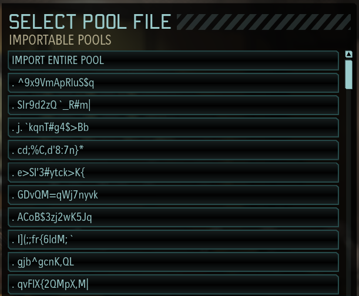
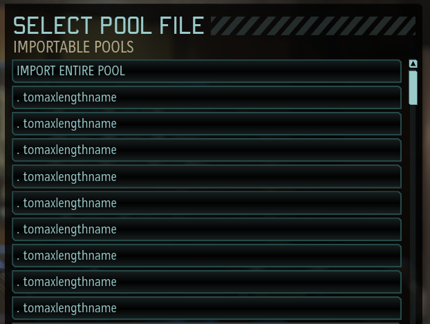
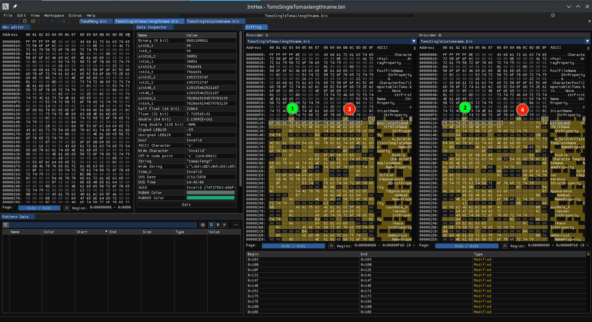

# XCOM 2 Custom soldier names

This script will edit the bytestrings of the lastnames of your soldiers in a given pool.

It is best to create a default template of a character. Then create a pool of clones (25, 50, 100, ..., 500) depending on how many you want to rename.



## Usage

Create your own template, pool or create custom clone (see below)

Input names in names.txt (one name per line). The game is limited to 15 characters max, the program will show you which names are invalid

Choose a Toms bin data  which is appropriate (or generate your own!) for your pool numbers and run it. e.g. copy ./data/Toms250.bin to ./Toms.bin

The output bin is constructed to have `Toms.bin` as filename. It's hard coded in the bin file! So after, make sure you rename input file the same as your output

example of running the script:
epython3 modify_lastname.py --input data/Toms400.bin --names names.txt --output Toms.bin`

## Pool creation if creating custom clone

Create a "Tom" which is your default character. I recommend to name it "tomaxlengthname" as its tied to the bytestring that gets replaced in the script
Export into a pool. Name it Toms
Export Tom again into Toms
Export Tom again in Toms
Repeat until you have 5 Toms in the pool and 1 in barracks
Now, import the 5 toms. Repeat until you have 26.
Delete 1 Tom so you have 25.
Create a new pool Tom25. Export all to Tom25
Import Tom25 so there's 50 total.
Create new pool Tom50. Export all (50) to Tom50  
Import Tom50. Now you have 100. Export to Tom100
Import Tom50. Now you have 150. Export to Tom150
repeat until you have enough Toms




## What bytestring do? lastname overwriting

ImHex screenshot
1, 2 numbers correlate with name length
selected is the string itself



modity bytestring [0x103,0x11D] of tomaxlengthname (Tom) to desired custom name and change the 2 numbers.

### Examples of names with their bytestring

tomaxlengthname (15) - Tom template
```
14 00 00 00 00 00 00 00 10 00 00 00 74 6F 6D 61 78 6C 65 6E 67 74 68 6E 61 6D 65
```

customname (10)
```
0F 00 00 00 00 00 00 00 0B 00 00 00 63 75 73 74 6F 6D 6E 61 6D 65

```

girty (5)
```
0A 00 00 00 00 00 00 00 06 00 00 00 67 69 72 74 79
```

. (1)
```
06 00 00 00 00 00 00 00 02 00 00 00 2E
```

## Resources:


UE modding resources
https://github.com/Buckminsterfullerene02/UE-Modding-Tools

ImHex - Written by WerWolv

    A Hex Editor for Reverse Engineers, Programmers and people who value their retinas when working at 3 AM.

Cutter - Written by Rizin

    Free and open source RE platform
    Decompiler, graph view, debugger, linear disassmbler, emulator, python scripting engine, plugins, binary patching, etc.


